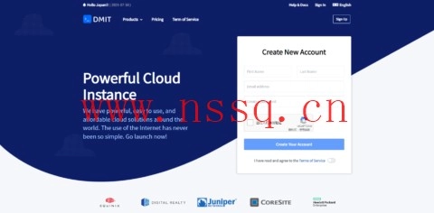

# DMIT Hong Kong VPS: Affordable Mobile CMI Connectivity Starting at $6.9/Month

Looking for a reliable Hong Kong VPS with excellent mobile network routing? DMIT's latest restock offers solid performance with 1 core CPU, 756MB RAM, 10GB SSD storage, and 2TB monthly traffic at 1Gbps bandwidth for just $6.9 per month. The standout feature? Triple-network return routing via China Mobile CMI, ensuring stable connections for mainland China users.

---

## What Makes DMIT Stand Out?

DMIT launched in 2017 as a US-based hosting provider, but they've carved out a reputation for high-quality network routes and impressive uptime. Unlike typical budget hosts, they focus on specialized connectivity options—you can choose between CN2 GIA bandwidth or BGP bandwidth routes, each with distinct advantages.

Their Los Angeles CN2 GIA VPS lineup targets users who need premium direct connections to mainland China. Meanwhile, their BGP routes offer generous bandwidth with unlimited traffic options. For international customers, payment is straightforward: PayPal, Alipay, and credit cards all work fine.

One thing to keep in mind: monthly subscriptions don't automatically guarantee globally-accessible IPs. You'll need to add a $1 guarantee during checkout if worldwide IP accessibility matters to you. Otherwise, if your assigned IP ends up blocked somewhere, replacing it costs $5.

## Hong Kong VPS Specifications

This current deal focuses on their Hong Kong Lite series. Here's what you get:

- **CPU:** 1 core
- **Memory:** 756MB RAM
- **Storage:** 10GB SSD
- **Traffic:** 2TB monthly allowance
- **Bandwidth:** 1Gbps shared
- **IP Address:** 1 IPv4 included
- **Price:** $6.9 per month

The network routing deserves special attention. For telecom users, you get dual CN2 GIA routes both ways. China Unicom traffic runs through AS10099 + AS4837. Most notably, China Mobile users benefit from direct backbone connections—no complicated peering arrangements that slow things down.

When testing connectivity matters to you before committing, here are the official test IPs:

**Hong Kong Lite VPS:** 103.135.248.*  
**Hong Kong Pro:** 103.117.100.20

## Premium CN2 GIA Options

Beyond the entry-level Hong Kong VPS, DMIT offers premium CN2 GIA packages with bandwidth ranging from 40Mbps to 500Mbps on shared connections. Each plan includes one IPv4 address by default.

The routing setup on these premium tiers mirrors the Hong Kong Lite approach: China Telecom gets double CN2 GIA paths, China Unicom routes through AS10099 and AS4837, while China Mobile enjoys direct backbone connectivity. This multi-carrier optimization means your VPS performs consistently regardless of which ISP your visitors use.

For projects requiring stable Asia-Pacific connectivity without breaking the budget, these specs hit a sweet spot. The 2TB traffic allowance handles most small-to-medium workloads comfortably. If you're running bandwidth-intensive applications, their BGP unlimited traffic plans might suit you better—though those typically come at higher price points.

If you're evaluating hosting options for China-facing services and need predictable network performance, 👉 [DMIT's multi-carrier routing approach eliminates the single-ISP bottleneck that plagues many Asia-Pacific VPS providers](https://www.dmit.io/aff.php?aff=13832). Their infrastructure emphasizes redundancy across telecom, unicom, and mobile networks rather than optimizing for just one carrier.

---

## Why DMIT Works for Asia-Pacific Deployments

DMIT built their service around a simple idea: network quality trumps raw specs for users targeting mainland China. A VPS with premium routing at modest specs often outperforms a powerful machine on congested networks.

Their Hong Kong location sits close enough to mainland China for low latency, while still operating outside the Great Firewall's direct restrictions. This geographical sweet spot combined with mobile CMI routing makes them particularly attractive for content delivery, API services, or any application where consistent mainland China accessibility matters.

The monthly pricing stays reasonable compared to other premium-route providers. At $6.9 per month for the current Hong Kong Lite offering, you're paying for the network engineering, not just compute resources. That said, if you need that guaranteed globally-routable IP, remember to factor in the extra dollar during checkout.

---

DMIT's Hong Kong VPS restock addresses a common pain point: finding affordable hosting that actually works well with China's complex ISP landscape. The 1-core/756MB configuration won't win benchmarks, but the triple-network return routing via mobile CMI delivers where it counts—stable, predictable connectivity. For $6.9 monthly, it's a practical choice if your traffic originates from or targets mainland China, and you'd rather spend time building your project than troubleshooting network issues.
